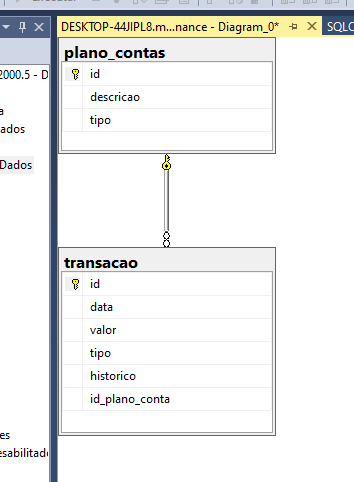

# myfinance-web-netcore
Myfinance - Projeto do Curso de Pós-Graduação em Engenharia de Software da PUC-MG

<html>
<header> </header>
<tile>Myfinance - Projeto do Curso de Pós-Graduação em Engenharia de Software da PUC-MG</title>
<body>
        
Estrutura do Banco de Dados - Aula 2

        
</body>
</html>